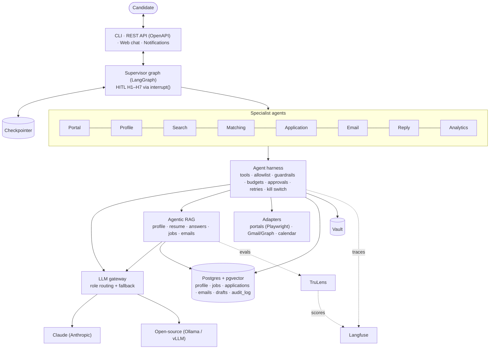
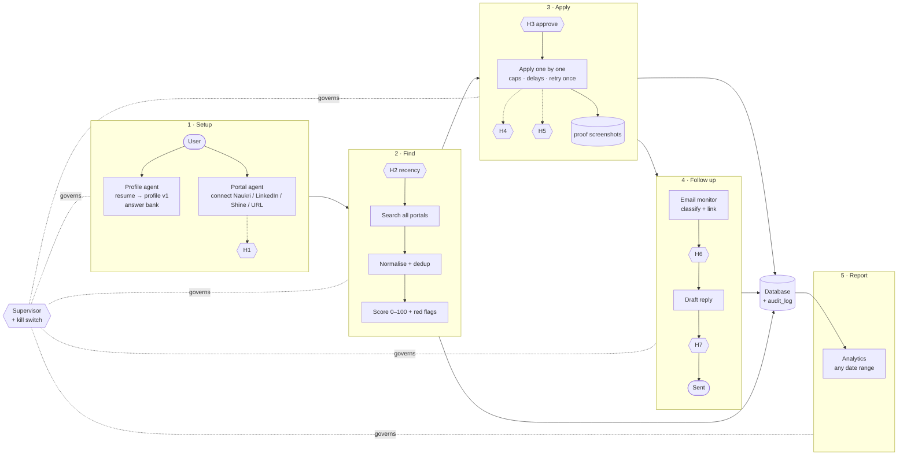
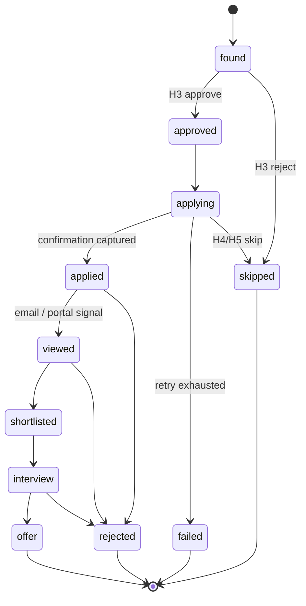
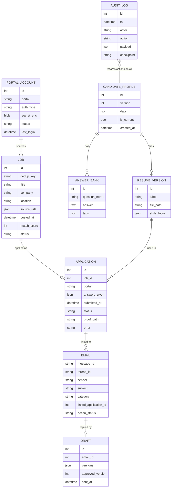

# 03 · Holistic View

## Everything in one picture

```mermaid
flowchart TB
    USER(["Candidate"]) <--> IF["CLI · REST API (OpenAPI) · Web chat · Notifications"]
    IF <--> SUP["Supervisor graph (LangGraph)<br/>HITL H1–H7 via interrupt()"]
    SUP <--> CK[("Checkpointer")]

    subgraph AG["Specialist agents"]
        direction LR
        PC["Portal"] --- PR["Profile"] --- JS["Search"] --- MR["Matching"] --- AP["Application"] --- EM["Email"] --- RD["Reply"] --- AN["Analytics"]
    end
    SUP --> AG

    AG --> HARN["Agent harness<br/>tools · allowlist · guardrails · budgets · approvals · retries · kill switch"]

    HARN --> GW["LLM gateway<br/>role routing + fallback"]
    GW --> CL["Claude (Anthropic)"]
    GW --> OS["Open-source (Ollama / vLLM)"]
    HARN --> RAG["Agentic RAG<br/>profile · resume · answers · jobs · emails"]
    RAG --> GW
    HARN --> INT["Adapters<br/>portals (Playwright) · Gmail/Graph · calendar"]

    HARN --> DB[("Postgres + pgvector<br/>profile · jobs · applications · emails · drafts · audit_log")]
    RAG --> DB
    HARN --> VA[("Vault")]

    HARN -. traces .-> LF["Langfuse"]
    RAG -. evals .-> TL["TruLens"]
    TL -. scores .-> LF
```

## End-to-end journey

```mermaid
flowchart LR
    subgraph SETUP["1 · Setup"]
        U1(["User"]) --> PRO["Profile agent<br/>resume → profile v1<br/>answer bank"]
        U1 --> CON["Portal agent<br/>connect Naukri / LinkedIn / Shine / URL"]
        CON -.-> H1{{"H1"}}
    end
    subgraph FIND["2 · Find"]
        H2{{"H2 recency"}} --> SRCH["Search all portals"] --> DD["Normalise + dedup"] --> RANK["Score 0–100 + red flags"]
    end
    subgraph APPLY["3 · Apply"]
        H3{{"H3 approve"}} --> AP["Apply one by one<br/>caps · delays · retry once"]
        AP -.-> H4{{"H4"}}
        AP -.-> H5{{"H5"}}
        AP --> PROOF[("proof screenshots")]
    end
    subgraph FOLLOW["4 · Follow up"]
        MON["Email monitor<br/>classify + link"] --> H6{{"H6"}} --> DR["Draft reply"] --> H7{{"H7"}} --> SENT(["Sent"])
    end
    subgraph REPORT["5 · Report"]
        STATS["Analytics<br/>any date range"]
    end

    SETUP --> FIND --> APPLY --> FOLLOW
    APPLY --> DB[("Database<br/>+ audit_log")]
    FOLLOW --> DB
    FIND --> DB
    DB --> STATS
    SUP{{"Supervisor<br/>+ kill switch"}} -. governs .- SETUP & FIND & APPLY & FOLLOW & REPORT
```

## Application status lifecycle

```mermaid
stateDiagram-v2
    [*] --> found
    found --> approved: H3 approve
    found --> skipped: H3 reject
    approved --> applying
    applying --> applied: confirmation captured
    applying --> failed: retry exhausted
    applying --> skipped: H4/H5 skip
    applied --> viewed: email / portal signal
    applied --> rejected
    viewed --> shortlisted
    viewed --> rejected
    shortlisted --> interview
    interview --> offer
    interview --> rejected
    offer --> [*]
    rejected --> [*]
    failed --> [*]
    skipped --> [*]
```

## Data model

```mermaid
erDiagram
    CANDIDATE_PROFILE ||--o{ RESUME_VERSION : has
    CANDIDATE_PROFILE ||--o{ ANSWER_BANK : has
    PORTAL_ACCOUNT ||--o{ JOB : sources
    JOB ||--o| APPLICATION : "applied as"
    RESUME_VERSION ||--o{ APPLICATION : "used in"
    APPLICATION ||--o{ EMAIL : "linked to"
    EMAIL ||--o| DRAFT : "replied by"
    AUDIT_LOG }o--|| CANDIDATE_PROFILE : "records actions on all"

    CANDIDATE_PROFILE {
        int id
        int version
        json data
        bool is_current
        datetime created_at
    }
    RESUME_VERSION {
        int id
        string label
        string file_path
        json skills_focus
    }
    ANSWER_BANK {
        int id
        string question_norm
        text answer
        json tags
    }
    PORTAL_ACCOUNT {
        int id
        string portal
        string auth_type
        blob secret_enc
        string status
        datetime last_login
    }
    JOB {
        int id
        string dedup_key
        string title
        string company
        string location
        json source_urls
        datetime posted_at
        int match_score
        string status
    }
    APPLICATION {
        int id
        int job_id
        string portal
        json answers_given
        datetime submitted_at
        string status
        string proof_path
        string error
    }
    EMAIL {
        string message_id
        string thread_id
        string sender
        string subject
        string category
        int linked_application_id
        string action_status
    }
    DRAFT {
        int id
        int email_id
        json versions
        int approved_version
        datetime sent_at
    }
    AUDIT_LOG {
        int id
        datetime ts
        string actor
        string action
        json payload
        string checkpoint
    }
```
